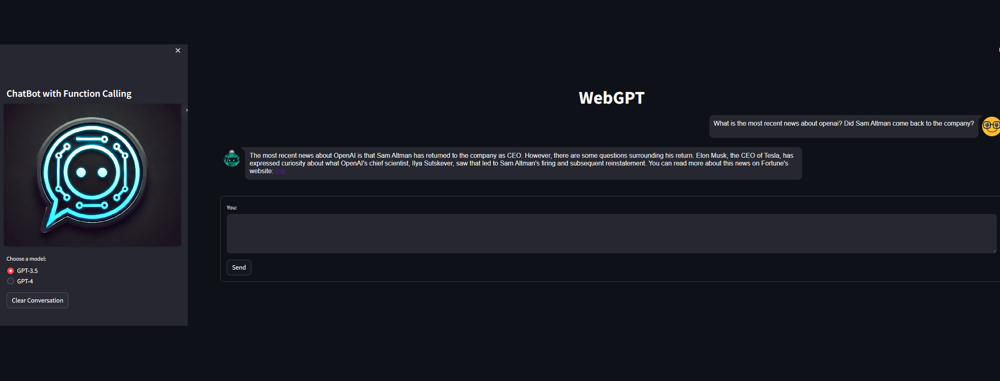

# Web-Chatbot-v0.5

This tool enables users to pose questions requiring real-time web searches. By leveraging GPT models, it performs the following tasks:

- Identifies and executes the most relevant Python functions in response to user queries.
- Utilizes a second GPT model to generate responses by combining user queries with content retrieved from a web search engine.
- Provides a user-friendly interface built using **Streamlit**.
- Supports diverse search types, including **text, news, PDFs, images, videos, maps, and instant responses**.
- Overcomes **knowledge cut-off limitations** by delivering answers based on the latest internet content.

## Streamlit User Interface
<div align="center">
  
</div>

### **Link in the Response of the Model to the Query**
<div align="center">
  
</div>

## Project Schema
<div align="center">
  
</div>

## Running the Project

The project requires setting up the environment and installing dependencies. There are two ways to do this:

### **Option 1: Using the Requirements File**
Activate the Python environment and install dependencies:

```
pip install -r requirements.txt
```

### **Option 2: Installing Dependencies Individually**
To install the required dependencies manually, run:

```
pip install streamlit==1.29.0 streamlit-chat==0.1.1 duckduckgo-search==4.1.1 openai==0.28.0 pydantic==2.5.1
```

### **1. Configuration and Execution**
- Navigate to the `configs` folder and update `app_config.yml` if needed.
- Create a `.env` file in the project directory and add the GPT API credentials.

For **OpenAI**:

```
OPENAI_API_KEY=
```

For **Azure OpenAI**:

```
OPENAI_API_TYPE=
OPENAI_API_VERSION=
OPENAI_API_KEY=
OPENAI_API_BASE=
gpt_deployment_name=
embed_deployment_name=
```

### **2. Activate the Environment**
Ensure that the virtual environment is activated before running the application.

### **3. Navigate to the WebGPT Directory**
Make sure the terminal is in the WebGPT project folder.

### **4. Run the Application**
Start the chatbot using Streamlit:

```
streamlit run src/webgpt_app.py
```
